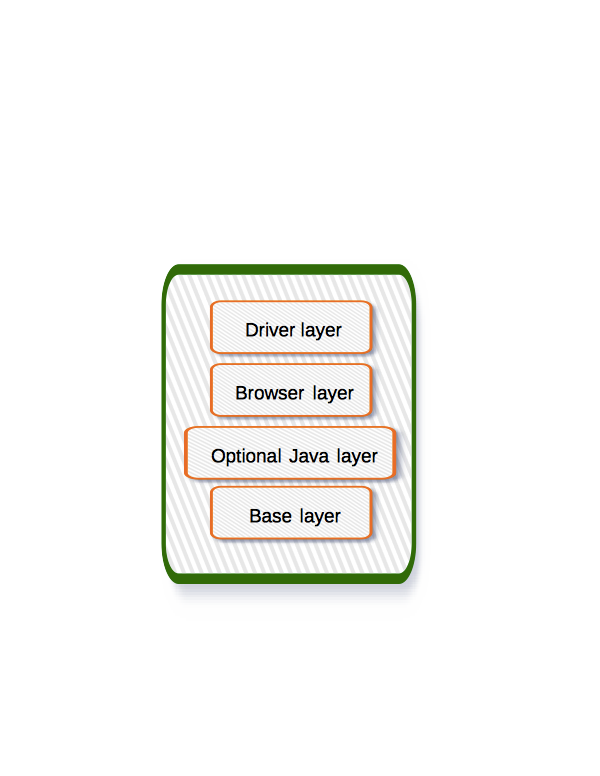

# Selenoid Docker Images
This repository contains [Docker](http://docker.com/) build files to be used for [Selenoid](http://github.com/aerokube/selenoid) project. You can find prebuilt images [here](https://hub.docker.com/u/selenoid/).

## Download Statistics

### Firefox: [](https://hub.docker.com/r/selenoid/firefox)

### Chrome: [](https://hub.docker.com/r/selenoid/chrome)

### Opera: [](https://hub.docker.com/r/selenoid/opera)

### Android: [](https://hub.docker.com/r/selenoid/android)

## How images are built



Each image consists of 3 or 4 layers:
1) **Base layer** - contains stuff needed in every image: Xvfb, fonts, cursor blinking fix, timezone definition and so on. This layer is always built manually.
2) **Optional Java layer** - contains latest Java Runtime Environment. Only needed for old Firefox versions incompatible with Geckodriver. This layer is always built manually.
3) **Browser layer** - contains browser binary. We create two versions: with APT cache and without it. The latter is then used to add driver layer.
4) **Driver layer** - contains either respective web driver binary or corresponding Selenium server version.

## How to build images yourself

Building procedure is automated with shell scripts ```selenium/automate_chrome.sh```, ```selenium/automate_firefox.sh``` and so on.

* Before building images you can optionally clone tests repository:
```
$ git clone https://github.com/aerokube/selenoid-container-tests.git
```
These tests require Java and Maven 3 to be installed. Tests directory should be cloned to this repository parent directory:
```
selenoid-images/ # <== this repo
selenoid-container-tests/ # <== optional tests repo
```
* To build a Firefox image use the following command:
```
$ ./automate_firefox.sh 63.0+build2-0ubuntu0.16.04.2 1.8.1 63.0 0.23.0
```
Here `63.0+build2-0ubuntu0.16.04.2` is `firefox` package version for Ubuntu 16.04, `1.8.1` is [Selenoid](https://github.com/aerokube/selenoid/releases) version to use inside image (just use latest release version here), `63.0` is Docker tag to be applied, `0.23.0` is [Geckodriver](http://github.com/mozilla/geckodriver/releases) version to use.

If you wish to pack a local Debian package instead of APT - just replace package version with full path to **deb** file:
```
$ ./automate_firefox.sh /path/to/firefox_63.0+build2-0ubuntu0.16.04.2.deb 1.8.1 63.0 0.23.0
``` 
It is important to use package files with full version specified name because automation scripts determine browser version by parsing package file name!

* To build a Chrome image use the following command:
```
$ ./automate_chrome.sh 70.0.3538.67-1 2.43 70.0
```
Here `70.0.3538.67-1` is `google-chrome-stable` package version for Ubuntu 16.04, `2.43` is [Chromedriver](https://chromedriver.storage.googleapis.com/index.html) version, `70.0` is Docker tag to be applied.  

* To build an Opera image use the following command:
```
$ ./automate_opera.sh 56.0.3051.31 .2.40 56.0
```
Here `56.0.3051.31` is `opera-stable` package version for Ubuntu 16.04, `.2.40` is [Operadriver](https://github.com/operasoftware/operachromiumdriver/releases) version, `70.0` is Docker tag to be applied.  

* To build an Android image use the following command:
```
$ ./automate_android.sh
```
This command is interactive - just answer the questions and it will build an image for you. In order to bundle custom APK to image - put it to `selenium/android` directory before running the script.

## Image information
Moved to: http://aerokube.com/selenoid/latest/#_browser_image_information
